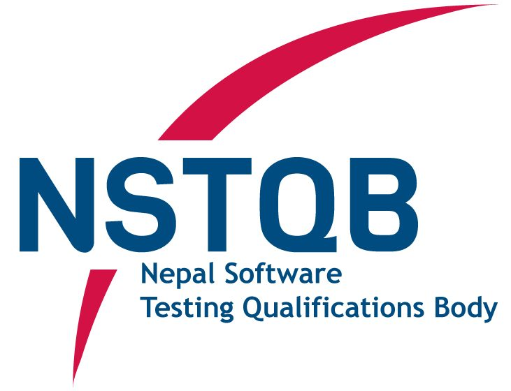

<div align="center">
  

# NSTQB

**Nepal Software Testing Qualifications Board** — certification, exam scheduling, and registration platform.

[](https://nextjs.org)
[](https://react.dev)
[](https://www.typescriptlang.org)
[](https://tailwindcss.com)
[](https://www.prisma.io)
[](https://www.postgresql.org)
[](./README.Docker.md)
[](https://pnpm.io)

[Live Site](https://nstqb.org) · [GitHub](https://github.com/NSTQB) · [LinkedIn](https://www.linkedin.com/company/nstqb/) · [Facebook](https://www.facebook.com/NSTQB) · [WhatsApp Community](https://chat.whatsapp.com/E91hKG6LannBqKtvaCpzl1)

</div>

---

## Stack

| Layer | Tech |
| --- | --- |
| Framework | [Next.js](https://nextjs.org) (App Router) + [React](https://react.dev) |
| Language | [TypeScript](https://www.typescriptlang.org) |
| Styling | [Tailwind CSS](https://tailwindcss.com) + [shadcn/ui](https://ui.shadcn.com) |
| Database | [PostgreSQL](https://www.postgresql.org) via [Prisma](https://www.prisma.io) |
| Email | [Nodemailer](https://nodemailer.com) / [Resend](https://resend.com) |
| Payments | Khalti, eSewa, HamroPay |
| Package manager | [pnpm](https://pnpm.io) |
| Containers | [Docker Compose](https://docs.docker.com/compose/) |

## Quickstart

```bash
# 1. Clone and enter the project
git clone https://github.com/NSTQB/Website.git
cd Website

# 2. Install dependencies
npm i

# 3. Copy the env template and fill in your values
cp .env.example .env

# 4. Start Postgres in Docker
docker compose up -d db

# 5. Once the container is up, run the app locally
npm run dev
```

Open [http://localhost:3000](http://localhost:3000).

> Prefer running the whole stack (app + database) in Docker with one command? See **[README.Docker.md](./README.Docker.md)**.

## Links

- 🌐 Live site — [nstqb.org](https://nstqb.org)
- 🐙 GitHub — [github.com/NSTQB](https://github.com/NSTQB)
- 🐳 Docker guide — [README.Docker.md](./README.Docker.md)
- 💬 WhatsApp community — [Join](https://chat.whatsapp.com/E91hKG6LannBqKtvaCpzl1)
- 💼 LinkedIn — [NSTQB](https://www.linkedin.com/company/nstqb/)
- 📘 Facebook — [NSTQB](https://www.facebook.com/NSTQB)
- 🎓 ISTQB — [istqb.org](https://www.istqb.org)
